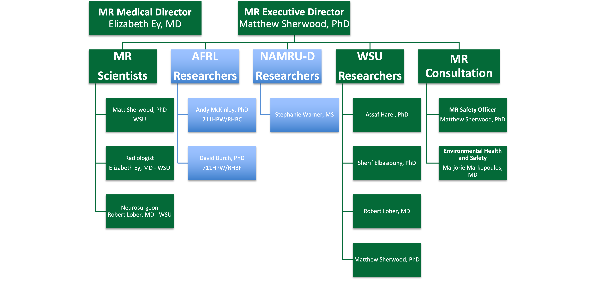

:topic: Administration

**********************************
Administration
**********************************

The CoNNECT is administered by a Governing Board which is chaired by the Executive Director, Dr. Matthew Sherwood. The Governing Board (see :numref:`org chart`) 
includes staff and faculty members from Wright State in addition to external constituents from the US Air Force, US Navy and local clinical facilities. The 
Governing Board meets regularly to review policies and procedures, and to review any safety incidents. 

.. _org chart:

      
   CoNNECT Governing Board active organization chart.
   

   
