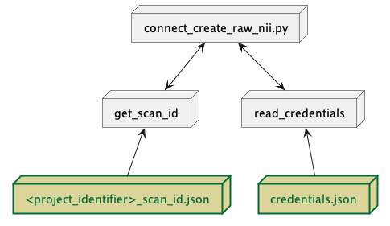

.. _connect_create_raw_nii_python:

connect_create_raw_nii.py
==========================

This function moves sourcedata NIfTI files (and JSON/txt sidecars) created from :ref:`connect_dcm2nii_python` or :ref:`convert_dicoms_python` to the corresponding rawdata directory. 

.. _project_code_directory:

      
   Required pre-requisite files for execution of connect_create_raw_nii.py.

This function can be executed via command-line only using the following options:

.. code-block:: shell-session

    $ connect_create_raw_nii.py -p <project_identifier> --progress --overwrite

.. code-block:: shell-session

    $ connect_create_raw_nii.py -p <project_identifier> --in-dir <path to single session's sourcedata> --progress --overwrite

-p PROJECT, --project PROJECT   **REQUIRED** project identifier to execute
-i IN_DIR, --in-dir INDIR   Only execute for a single subject/session by providing a path to individual subject/session directory
-h, --help  show the help message and exit
--progress  verbose mode
--overwrite    force create of rawdata files by skipping file checking
-v, --version   display the current version
