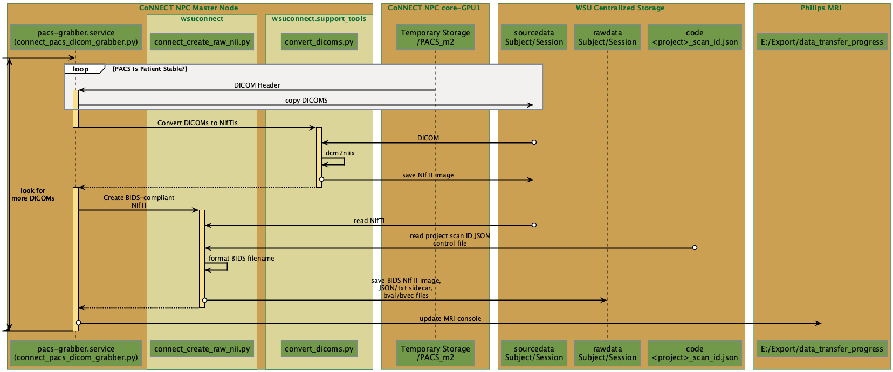
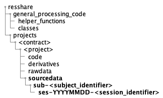

connect_pacs_dicom_grabber.py
==========================

.. _pacs_grabber_diagram:

      
   Sequence diagram for the CoNNECT PACS DICOM grabber python function.
    

This function moves DICOM images from their local temporary PACS storage location (/resshare/PACS) to their associated sourcedata directory (:numref:`pacs_grabber_sourcedata_directory`), performs DICOM-to-NIfTI conversion via convert_dicoms.py, and 
moves the NIfTI files into a BIDS structure within the Project's rawdata directory (:numref:`pacs_grabber_diagram`). The <project identifier>, <subject identifier>, and <session identifer> (optional) are extracted from the DICOM header 
'Patient Name' tag. These elements are space-delimited. The <session identifier> is appended to an acquisition date identifier using the format YYYYMMDD. 

.. _pacs_grabber_sourcedata_directory:

      
   Final location of source DICOM data following transfer from MRI via Orthanc PACS and connect_pacs_dicom_grabber.py.

.. note:: This function is continuously running in the background on the CoNNECT NPC master node (and loaded at startup) as the pacs-grabber.service.

This function can be executed via command-line only using the following options, HOWEVER, beware to ensure the pacs-grabber.service is stopped prior to running:

.. code-block:: shell-session

    $ connect_pacs_dicom_grabber.py 

-h, --help  show the help message and exit
-v, --version   display the current version

