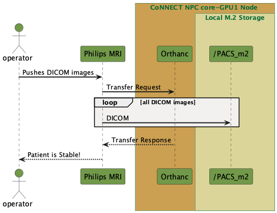

Open-Source Software
====================

Picture Archiving and Communication System (PACS)
-------------------------------------------------

`Orthanc <https://www.orthanc-server.com/>`__ is the official open-source PACS system in place at the WSU CoNNECT. Using this system, which runs on the 
:doc:`master node of the CoNNECT NPC </cluster_computing/master.rst>`, DICOM images can be sent directly from the MRI scanner to the CoNNECT NPC centralized storage.
The PACS Grabber Service then automatically detects new dicoms arriving to the PACS storage location, moves them to the appropriate project/subject/session's sourcedata
directory, converts them to NIfTI files and stores them in the project/subject/session's rawdata directory according to BIDS specifications.

.. _orthanc_server:

      
   PACS data transfer from MRI to centralized storage via CoNNECT NPC.

Image Viewing and Analysis Software
-----------------------------------

AFNI
^^^^

AFNI is an NIH developed suite to visualize and analyze functional imaging.

The afni package (installed from http://neuro.debian.net/pkgs/afni.html) is located at /usr/share/afni.

AFNI is commonly utilized to overlay fMRI statistics from FSL FEAT or other output on top of T1-weighted images. Through AFNI surface mapper (SUMA), freesurfer inflated volumes 
can be used as the background image for the statistics, which can be viewed in 3D, as well as many other views. With certain datasets, this can provide powerful visuals.

.. code-block:: shell-session

    $ afni

dcm2niix
^^^^^^^^

Dcm2niix is a conversion software package developed at Chris Rorden’s Neuropsychology Lab at University of South Carolina and is the distributed by NeuroImaging and Resources Collaboratory (NITRC).

A copy of dcm2niix has been compiled and placed in the scratch ‘bash’ folder, /mnt/ss_rhb1/scratch/bash. This path has been added to the system path so it can be ran from any directory without the need to know the location. A copy is also in the ubuntu user download folder.

The function dcm2niix converts raw DICOM images to NIfTI (or other) formats. The function should be executed with the flags specified in Table 4.

.. code-block:: shell-session

    $ dcm2niix

Freesurfer
^^^^^^^^^^

Freesurfer Freesurfer is developed by Massachusetts General Hospital/Harvard University to analyze MRI images of the brain. The current 
version is 7.1.1; however, version 6 is installed.

The freesurfer package (installed from ) is located at /usr/share/freesurfer. This path is stored in the FREESURFER_DIR variable available 
in bash and c-shell terminals. 

common functions: 

Main freesurfer command to begin the cortical reconstruction process. The entire process takes 12-24hrs to complete. Preferred command 
line arguments are provided in Table 3. 

.. note:: CREATE TABLE

.. code-block:: shell-session

    $ recon-all 

The volume and surface viewer to assess quality of cortical reconstruction.

.. code-block:: shell-session

    $ freeview

FMRIB Software Library (FSL)
^^^^^^^^^^^^^^^^^^^^^^^^^^^^

FSL FMRIB Software Library (FSL) is a library of fMRI, MRI and DTI analysis tools developed by Oxford University, UK. The current installed version is 6.0.4. 

The fsl package is located at /usr/share/fsl/6.0. This path is stored in the FSL_DIR variable available in bash and c-shell terminals.

**Common Functions**

.. code-block:: shell-session

    $ fsl

Main GUI for FSL. This GUI can be used to create individual and higher-level designs for fMRI analyses, execute individual or higher-level designs of fMRI analyses, 
run brain extraction, process DTI, perform registration, perform ICA for resting-state fMRI, or generate simulated MRI scans. 

.. seealso:: 
    Details can be found `here <https://fsl.fmrib.ox.ac.uk/fsl/fslwiki/FSL>`__. 

.. code-block:: shell-session

    $ fsleyes 

MRI visualization GUI. 

.. seealso::
    The user guide can be found `here <https://users.fmrib.ox.ac.uk/~paulmc/fsleyes/userdoc/latest/>`__.

.. code-block:: shell-session

    $ feat

Command line tool to execute fMRI design files. 

.. seealso::
    More info can be found `here <https://fsl.fmrib.ox.ac.uk/fsl/fslwiki/FEAT>`__. 

.. code-block:: shell-session

    $ randomise

Randomise (and randomise_parallel) is a non-parametric permutation inference tool for neuroimaging data. Randomise utilizes 
modelling and inferences using standard designs as used in FEAT. The main pitfall of randomize is the accommodation of correlated 
datasets (repeated measures). However, some cases of repeated measures can be accommodated. 

.. code-block:: shell-session

    $ oxford_asl

oxford_asl is a command line utility that can quantify cerebral perfusion (CBF) data from ASL, including 
motion-correction, registration, partial volume correction, and distortion correction. 

.. seealso::
    Command line user guide for `oxford asl <https://asl-docs.readthedocs.io/en/latest/oxford_asl_userguide.html>`__ or  `BASIL <https://fsl.fmrib.ox.ac.uk/fsl/fslwiki/BASIL>`__,
    the GUI-based version of oxford_asl.

LCModel
^^^^^^^

.. note:: To be developed
