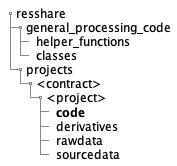

:topic: Project-Specific JSON Control Files

.. _json_control_files:

***********************************
Project-Specific JSON Control Files
***********************************

The CoNNECT custom developed support tools utilize JSON control files from each project's **CODE** bids directory (:numref:`project_code_directory`). 
The files are named as <project_identifier>_<data_type>_<process>_input.json. Data types are specified in :numref:`input_data_types` and available 
processes are flirt and bet. 

.. _project_code_directory:

      
   Directory tree showing the location of a Project's JSON control files.

.. _input_data_types:

.. list-table:: Data types.
   :widths: 25 75
   :header-rows: 1

   * - **Data Type**
     - **Source Image Description**
   * - struc
     - T1-weighted image
   * - asl
     - arterial spin labeling or cerebral blood flow image
   * - apt
     - amide proton transfer-weighted source or MTRasym image
   * - flair
     - T2 FLAIR image
   * - T2
     - T2 or T2* image

.. include:: brain_extraction.rst
.. include:: flirt_control.rst
.. include:: scan_id.rst

